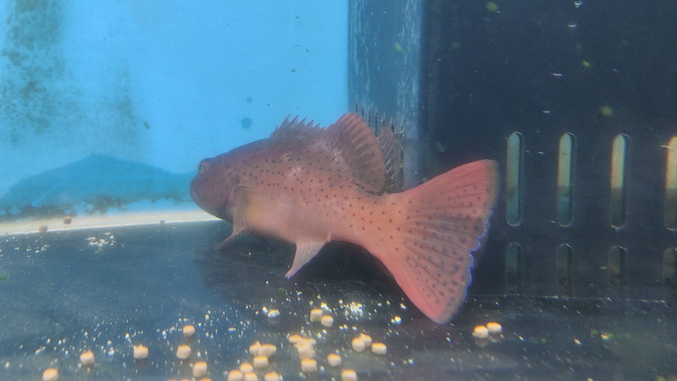

# PLGAT: Underwater Plectropomus leopardus Recognition Using Global Attention Mechanism and Transfer Learning

This is the official code repository for the paper.

## Project Description

This repository contains the source code for our method, as well as some code for generating charts. The logical structure of our code is as follows:

    "runs" folder stores the results of training and testing.
    "ultralytics" folder contains the source code for the model.
    "yolo_cam" folder includes a package for visualizing attention.
    "confusionmm.py" file is the source code for generating confusion matrices.
    "mytrain.py" file is the code for training the model.
    "predict.py" file is the source code for testing the model.
    "visualization_attention2.py" file is the code for visualizing attention.


## Installation Instructions

**Step 1: Set up the environment**

Create a conda environment using the following command:
```shell
conda create --name <env> --file requirements.txt
```

**Step 2: Download the dataset**
Here are the download links for the PLRD dataset:

    [Google Drive](https://drive.google.com/file/d/1SEARTtwYwROGV1U8RNbmGqaVnAc6cMpf/view?usp=drive_link)
    [Baidu Netdisk](https://pan.baidu.com/s/11uexb77pWXRBL_E3WhTzKQ?pwd=s7ee )提取码：s7ee


## Usage Instructions

**Step 3: Train and test the model**

To train the model, run the following command:
```shell
python mytrain.py
```
To test the model, run the following command:
```shell
python mypredict.py
```

## Example

Here is an example of how to use the PLGAT model for underwater Plectropomus leopardus recognition:

```python
from ultralytics import YOLO

# Load a model
model = YOLO('/home/whut4/zwj/ultralytics/runs/detect/GAM-Enhanced/weights/best.pt')  # load a custom model

# Validate the model
metrics = model.predict(source='/home/whut4/zwj/0426underwater/dataset2 copy 8/test/images/VID_20230414_150420-0003.jpg',save=True,save_txt=True,save_conf=True,name='example')  # no arguments needed, dataset and settings remembered

```


## Contribution Guidelines

Thank you for considering contributing to our project! We welcome any contributions that can help improve the project and make it better. To ensure a smooth collaboration, please follow the guidelines below.

### Reporting Issues
To report an issue, please follow these steps:

- Go to the Issue Tracker on our GitHub repository.
- Click on the "New Issue" button.
- Provide a descriptive title for the issue.
- Clearly describe the problem, including any relevant information or steps to reproduce it.
- Add appropriate labels or tags to categorize the issue (e.g., bug, enhancement, documentation).
- Submit the issue.

## Acknowledgements

The work described in this paper was partially supported by the National Key Research and Development Program
of China (2022YFD2400501) and the Hainan Yazhou Bay Seed Laboratory (B21HJ0110).

## Contact Information

Please contact us via junweizhou@msn.com
